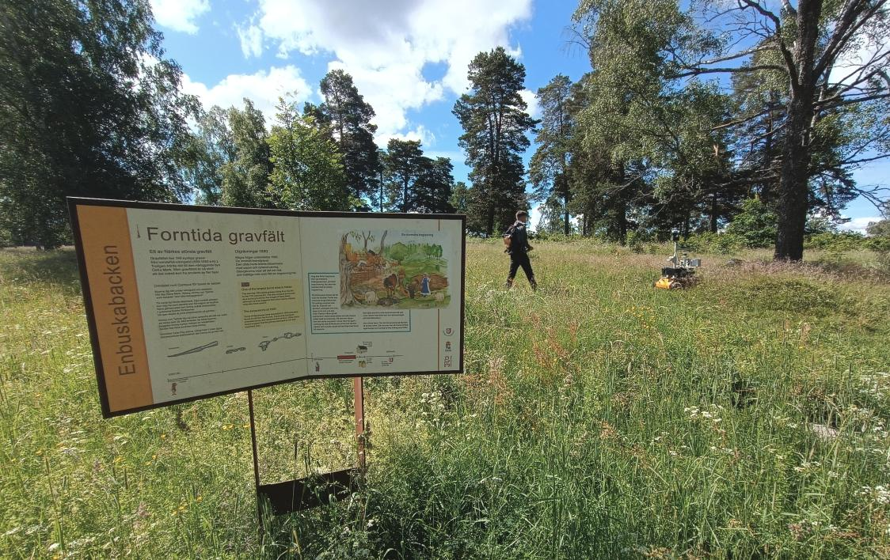

### 📚 Table of Contents

* [Dataset Description](#dataset-description)
* [Dataset Parts](#dataset-parts)
* [Data Structure and File Organization](#data-structure-and-file-organization)
* [Downloads](#downloads)
* [Examples and Teasers](#examples-and-teasers)

# The Viking Hill Dataset and Technical Details

## Dataset description

*The recorded track captures the [Enbuskabacken](https://www.lansstyrelsen.se/orebro/besoksmal/kulturmiljoer/enbuskabacken.html) area in Örebro.*

The dataset consists of a single long trajectory through a forested area (approx. 200x200m) at the Örebro university campus.
It was recorded in summer 2024, during the vegetation peak. The terrain is uneven because the area used to serve as a burial ground during the Viking Age (550-1050 AD).
The dataset includes LiDAR, 4D Radar, GNSS, RGB camera and IMU.

---

## Dataset Parts
### Public Training Part

* **grass_track_training** (1566s)
 Initial portion of the area (the northern part)

### Hidden Testing Part

* **grass_track** (4155s)
 The complete area, including the southern part.  
---

## Data Structure and File Organization

```
data/
├── calibration
│   ├── extrinsics
│   │   ├── extrinsics.txt
│   │   └── frames.pdf
│   └── intrinsics
│       ├── camera_calibration.txt
│       └── hugin_radar_startup_params.txt
├── test
│   └── grass_track
│       └── < FILES NOT PROVIDED>               
└── train
    └── grass_track_training
        ├── bag_files
        │   ├── grass_track_training__2025-06-12-22-12-48_0.bag
        │   ├── ...
        │   └── grass_track_training__2025-06-12-23-38-13_31.bag
        └── reference
            ├── reference_train_bagfile.bag
            ├── reference_train_gps_in_utm_format.csv
            ├── reference_train_gps_rtk_in_robot_time.csv
            └── source_rtk_solution_from_Emlid_RTKLIB
                ├── gps_filtered_high_accuracy.pos
                ├── gsp_original_post_fix_including_bad_sections.pos
                └── train_robot_time_to_gps_time.csv
```

* `rass_track_training__<sequence time and number>.bag` → Raw sensory data and static transforms.
* `reference/` → Folder containing reference RTK trajectories.
* `calibration/extrinsics/` → Transformations between sensor frames.
* `calibration/instrinsics/` → Intrinsic parameters for the camera and radar settings.

### Sensors
The dataset provides sensor measurements from these sensors:

* Sensrad Hugin A3-Sample (solid-state 4D radar)
* Ouster OS0-32 (3D lidar)
* IDS Imaging uEye camera (2056x1542px)
* Xsens MTi-30 (IMU)
* Emlid Reach RS2+ (RTK-GNSS receiver pair)

### Reference Contents

The dataset contains a `reference/` subdirectory with:

* `reference_train_bagfile.bag`: Reference GNSS RTK localization synchrized with the robot time, saved as a bag file.
* `reference_train_gps_in_utm_format.csv`: The GNSS RTK expressed in the UTM coordinates, with time stamps from the robot. Format: **secs, nsecs, northing[m], easting[m], elevation, qx, qy, qz, qw**. Note that the quarternion is always identity.
* `reference_train_gps_rtk_in_robot_time.csv`: Contains the same information as `reference_train_gps_in_utm_format.csv`, but expressed in latitude and longitude. Format: **secs, nsecs, latitude, longitude, elevation**
* `gps_filtered_high_accuracy.pos`: RTK solution used to generate the reference samples for the files above. It does not contain sections with too few sattelites. Note that the displayed time is the GPS time (no time zone, no step seconds).
* `gsp_original_post_fix_including_bad_sections.pos`: Complete RTK solution, wih all samples including the noisy ones.
* `train_robot_time_to_gps_time.csv`: Conversion from the robot time to the time indicated by the GNSS. The robot was no exactly synchronized with the GNSS, there is approx. 0.6s offset. This file can be used to match those times. Format: **robot secs, robot nsecs, gnss secs, gnss nsecs** 

---

## Downloads

* [All training data](https://comrob-ds.fel.cvut.cz:9001/api/v1/buckets/cb-slam/objects/download?prefix=data/train/) (52 GB, \~27 GB download)
* [extrinsics](https://comrob-ds.fel.cvut.cz:9001/api/v1/buckets/cb-slam/objects/download?prefix=data/train/extrinsics/) (16 kB)
* [shellby-0225-train-lab](https://comrob-ds.fel.cvut.cz:9001/api/v1/buckets/cb-slam/objects/download?prefix=data/train/shellby-0225-train-lab/) (5.5 GB, \~3.3 GB download)
* [shellby-0225-train-loop1](https://comrob-ds.fel.cvut.cz:9001/api/v1/buckets/cb-slam/objects/download?prefix=data/train/shellby-0225-train-loop1/) (47 GB, \~24 GB download)

---

## Examples and Teasers


*Example environments where data was collected.*

### Video Teasers

#### Train Dataset

[](https://comrob-ds.fel.cvut.cz:9000/cb-slam/media/videos/shellby-0225-train-loop1-teaser.mp4)

#### Test Datasets

[](https://comrob-ds.fel.cvut.cz:9000/cb-slam/media/videos/shellby-0225-test-loop1-teaser.mp4)

[](https://comrob-ds.fel.cvut.cz:9000/cb-slam/media/videos/shellby-0225-test-loop2-teaser.mp4)
